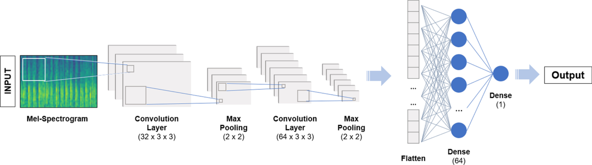

# MelSpectrogram 
---
- visual representation of an audio signal that shows how the energy or power of the signal distributed across different frequiencies over time.
- frequency scale is transformed to how human percieve sound

***x_axis***: Time

***y_axis***: frequency but scaled matched to human hearing

***color***: represents strengths or amplitude of the signal at that time and frequency point

 
---
# Steps 
---
1) we plot using the audio file over time
2) we map from time to frequency domain using **the fast fourier transform**
3) we convert y-axis (frequency) to log scale and color dimensions(amplitude) to decibels to form the spectrogram
4) we map y-axis onto mel scale to form the MelSpectrogram
---

# Why Fourier transform
---
- used to convert time domain to frequency domain
 

- many important audio features are based on the frquency content of the signal
- easier to apply filters like removing noise, or enhance the specefic components of the signal
---

## fast forier transform
---
- uses $O(n log(n))$
---

# MelScale
---
- human are more sensitive to lower frequiencies and less sensitive to higher frequiencies
- the mel scales adjust the frequiencies axis of the spectrogram to match human hearing
- here lower frequiencies are spaced out more, while higher frequiencies are spaced out closer together
---

